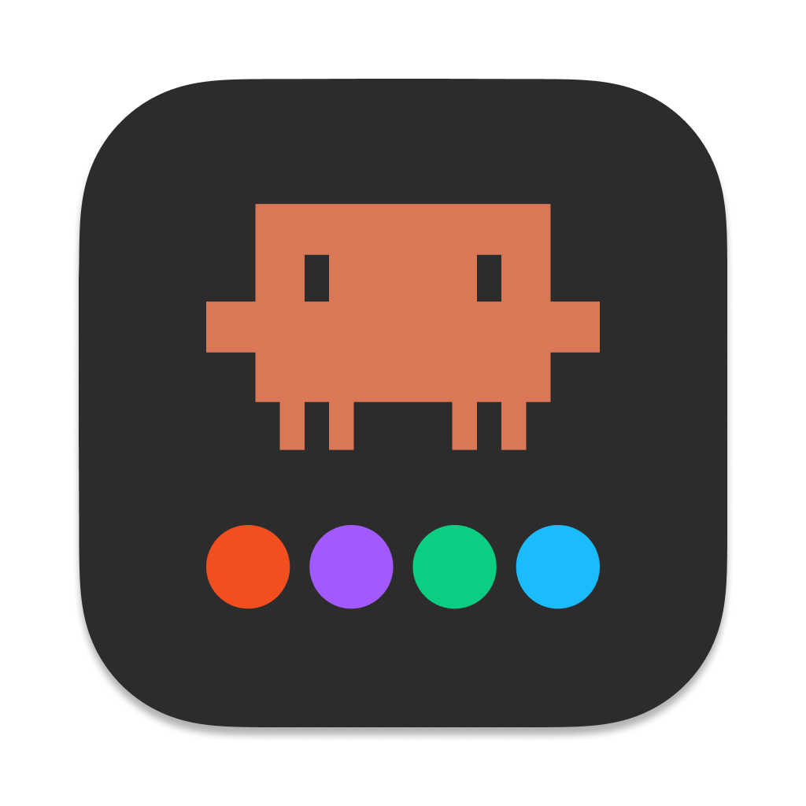
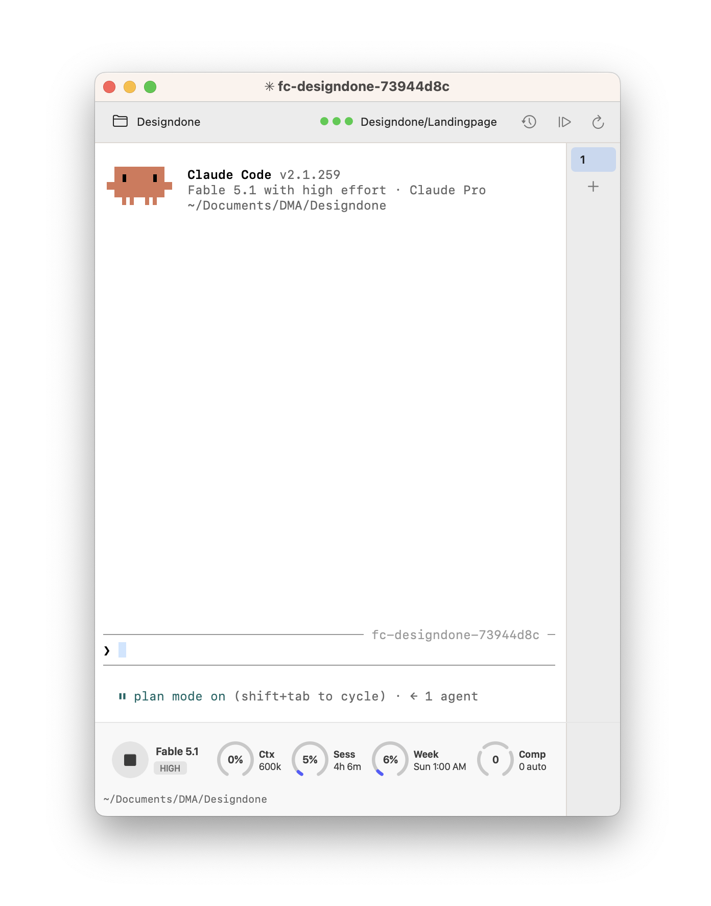

<p align="center">
  
</p>

# Figma Claude

<p align="center">
  <a href="https://github.com/clementcopper/figma-claude/actions/workflows/test.yml"></a>
  
  
  
  
  <a href="https://github.com/silships/figma-cli"></a>
  <a href="https://designdone.de"></a>
</p>

<p align="center">
  <b>Claude Code in a window next to Figma &mdash; one that knows what Figma has open and what you have selected.</b>
</p>

<p align="center">
  
</p>

<p align="center">
  <sub>The title is the session's own name, the dots are the connection into Figma, the rings are
  Claude's status line, and the last row is the working directory.</sub>
</p>

---

## What this is

Two things, and it matters which is which.

**The CLI is [silships/figma-cli](https://github.com/silships/figma-cli) by [Sil
Bormüller](https://www.linkedin.com/in/silbormueller)** — everything that actually moves a pixel in
Figma. It drives Figma Desktop over the debugging protocol, so there is no API key, no cloud
roundtrip and no plugin to keep open: render frames and components from JSX, manage variables and
tokens, extract a whole file as Markdown, audit contrast. That work is his, this repo is a fork of
his, and the useful fixes go back upstream.

**Figma Claude is the app around it**, built by [Clement
Copper](https://github.com/clementcopper): a macOS window that runs Claude Code beside Figma and
tells it what Figma is doing. Driving Figma by conversation works — sitting in front of two
terminal windows to do it does not.

## Quick start

```bash
git clone https://github.com/clementcopper/figma-claude.git ~/figma-cli
cd ~/figma-cli && npm install                     # the CLI

cd swift-host
swift build -c release && bash Tools/make-app.sh  # the app: Xcode command line tools, no Node
open "build/Figma Claude.app"
```

Unsigned, so right-click → **Open** the first time. In the window, pick a working directory and
start describing what you want built. Figma updates in front of you.

You do not tell Claude to connect. The app polls Figma itself, and the three dots in the toolbar
say what it found. Only when the way in is genuinely missing does its Figma menu offer
**Connect** — one click, not a sentence. The Yolo patch survives a restart, so after the first
time there is usually nothing to do at all.

## The window

- **Claude's status line as rings** — context, session, weekly limit and compactions, each a dial
  that turns amber and then red as it fills. Claude Code hands that data to a `statusLine` command,
  which the app supplies per session by calling its own binary, so your `~/.claude/settings.json`
  is never touched and nothing needs to be on your `PATH`.
- **Tabs**, resume and continue a conversation in place, restart. Each tab gets a name of its own —
  `fc-<figma file>-<session id>` — so the `/resume` picker can tell them apart.
- **A working directory you pick**, because Claude Code keeps its history per directory: that
  choice decides which conversations `--resume` offers.
- **Figma's state**: dots for the daemon and the connection into Figma, the open file's name, one
  click to reconnect. With something selected, a band above the rings puts that selection — names
  and node ids — into the prompt.

Building it, the render probes and the architecture:
**[swift-host/README.md](swift-host/README.md)**.

## The CLI underneath

`figma-cli` is a command you can use on its own, and Claude uses it constantly:

```bash
figma-cli connect                 # find Figma, open the channel
figma-cli render '<Frame …>'      # JSX in, Figma nodes out
figma-cli tokens import …         # variables and collections
figma-cli extract > DESIGN.md     # a whole file as Markdown
figma-cli a11y                    # contrast audit
```

- **[REFERENCE.md](REFERENCE.md)** — every command, every flag.
- **[docs/FIGMA-USAGE.md](docs/FIGMA-USAGE.md)** — the usage guide: JSX rules, tokens, slots,
  motion, the pitfalls. Read it a section at a time with `figma-cli docs <topic>`; the whole guide
  costs about 10k tokens, one topic about 900.

## How it reaches Figma

Three ways, all doing the same things, all local:

| | |
|---|---|
| **Yolo** (default) | patches one string in Figma Desktop's `app.asar` so the CLI can talk to it directly. Reversible, and the fastest hands-off route. Needs the macOS *App Management* permission |
| **Browser** | runs Figma in a Chromium browser under its own profile. Same speed, the desktop app is never modified |
| **Safe** | a small Figma plugin you keep open. Nothing is patched at all |

What each one touches, what the local daemon does and where credentials live:
**[SECURITY.md](SECURITY.md)** — that is also the page for whoever approves tools at your company.

## What this fork adds

| | |
|---|---|
| `swift-host/` | Figma Claude, the app above |
| `app/` | its Electron predecessor, still building, no longer developed |
| `bin/fig-start` | connect, then pick among the open Figma files |
| `bin/fig-status` | Figma, CDP, daemon and the active file at a glance |
| `bin/fig-feedback-setup` | the machine-side half on a new machine: the feedback rule and its hooks, the Framelink MCP server, the handoff hook |
| non-destructive `connect` | never quits a Figma that is already debuggable |

The CLI fixes are offered back: [#40](https://github.com/silships/figma-cli/pull/40) (connect),
[#41](https://github.com/silships/figma-cli/pull/41) (`docs <topic>`),
[#43](https://github.com/silships/figma-cli/pull/43) (render fixes for
[#42](https://github.com/silships/figma-cli/issues/42)) and
[#44](https://github.com/silships/figma-cli/pull/44) (text styles). Once they land upstream, the
copies here go away.

## Layout

| | |
|---|---|
| `swift-host/` | the app — Swift and AppKit ([README](swift-host/README.md)) |
| `src/` | the CLI — commands, the CDP client, the JSX parser, the daemon |
| `app/` | the Electron predecessor ([README](app/README.md)) |
| `plugin/` | the Figma plugin Safe Mode uses |
| `docs/`, `REFERENCE.md` | the usage guide and the command reference |
| `skills/`, `.claude-plugin/` | this repo, installable as a Claude Code plugin |
| `bin/` | `fig-start`, `fig-status`, `fig-feedback-setup` |

## Developing

```bash
npm test                                   # 697 cases, no Figma touched
cd swift-host && swift run CoreChecks      # 470 cases, no window
```

Both run in CI on every push to `master`: the CLI suite on Linux across Node 18, 20 and 22, and a
macOS job that builds the Swift package. Working on the app starts at
[swift-host/README.md](swift-host/README.md); working on the CLI, at [CLAUDE.md](CLAUDE.md).

## Who built what

**The CLI — [Sil Bormüller](https://www.linkedin.com/in/silbormueller)**, founder of [Into Design
Systems](https://www.intodesignsystems.com/), the conference and training platform for design
system practitioners. The CDP connection, render/JSX, tokens, extract, validation — all of it is
his. [@silships](https://github.com/silships) ·
[silbormueller.com](https://www.silbormueller.com/) ·
[newsletter](https://intodesignsystems.substack.com/)

**The terminal panel — [nolikzero](https://github.com/nolikzero)**, author of
[claude-terminal-panel](https://github.com/nolikzero/claude-terminal-panel) (MIT, © 2025), the VS
Code extension whose interface Figma Claude runs: tabs, toolbar, status line, prompt detection. The
Electron host copies its webview and message protocol byte-identical — see
[app/PORTED-FROM.md](app/PORTED-FROM.md) — and the Swift host is a second port of that same
interface, drawn in AppKit rather than a webview.

**Figma Claude and this fork — [Clement Copper](https://github.com/clementcopper)**, interface
designer and design engineer behind [**designdone.de**](https://designdone.de), interface design
and design engineering as a monthly subscription. The window and its toolbar, the ring status line,
the working-directory picker, the bridge to the CLI daemon, the icon and the packaging — plus the
CLI additions above, which go back upstream.

Found a vulnerability? In the CLI: [privately to
silships](https://github.com/silships/figma-cli/security/advisories/new) or
sil@intodesignsystems.com. In Figma Claude, `bin/` or the connect patch: [this repo's
advisories](https://github.com/clementcopper/figma-claude/security/advisories/new). Not in a public
issue.

## License

MIT, all three parts:

- figma-cli — © [Sil Bormüller](https://www.linkedin.com/in/silbormueller)
- the panel UI in `app/media` and `app/src/host` — © 2025 [nolikzero](https://github.com/nolikzero)
  ([`app/LICENSE-claude-terminal-panel`](app/LICENSE-claude-terminal-panel))
- Figma Claude and the rest of this fork — © [Clement Copper](https://github.com/clementcopper)
