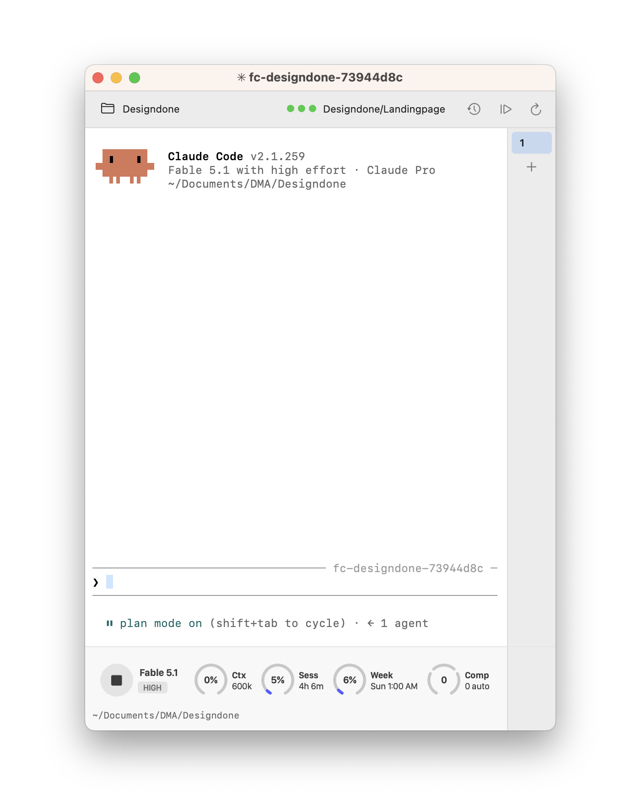

# Figma Claude — the Swift host

Claude Code in a macOS window next to Figma, written in Swift and AppKit. This is the app that is
being developed; the Electron version it grew out of still sits in [`app/`](../app/README.md) and
is not.

It is a window around three things: a terminal running Claude Code, Claude's status line drawn as
rings instead of text, and a live view of what Figma has open and selected.

<p align="center">
  
</p>

## Building

Xcode's command line tools and nothing else — no Node, no `npm install`, no native module to
rebuild.

```bash
swift build -c release && bash Tools/make-app.sh
open "build/Figma Claude.app"
```

`make-app.sh` assembles the bundle around the release binary: `Info.plist`, the icon (taken from
`../app/build/icon.icns`, so both hosts wear the same one) and an ad-hoc signature, which
unsigned bundles need on Apple Silicon. There is no `xcodebuild` anywhere here and none is
needed — an `.app` is a directory with an `Info.plist`.

The binary links against the SDK of the Mac that builds it, and AppKit changes behaviour with the
SDK: the first build on macOS 26 lost toolbar and tab strip to a `draw(_:)` that filled
`dirtyRect`. After a build on a new machine or macOS, run `--render-chrome` (below) — its
`[probe] separators` line ends in `ok` or `FAIL`.

The bundle carries three numbers, all visible in **About Figma Claude**:

| | |
|---|---|
| `VERSION` | the version, set by hand |
| `CFBundleVersion` | the commit it was built from, suffixed `+` when the tree was dirty |
| `FCBuildDate` | that commit's date |

So the running app can always answer "which build is this?" — worth more than it sounds, because
a stale process that looks like the new one costs an afternoon of debugging something already
fixed.

## MCP in the panel

Every tab starts Claude Code with `--mcp-config ~/.figma-ds-cli/mcp-framelink.json` when that
file exists (`panelMcpConfigPath`, `panelArguments`). `fig-feedback-setup` writes it: the
Framelink server with the Figma key as env, mode 600. Nothing is added to `~/.claude.json`, so a
terminal session does not see Framelink unless it passes the same flag — on the whole machine,
off by default, on in the panel. A project that disabled `framelink` via `/mcp` stays disabled
here too, the name is the same.

## Status line

Two producers write one directory, `~/.figma-ds-cli/statusline/`, and `StatusLineWatcher` polls it
once a second and merges per tab:

- **`<tab id>.json`** — Claude Code's own status line. Every tab runs with
  `--settings '{"statusLine":{"command":"FigmaClaude --statusline"}}'` and the two variables
  `CLAUDE_PANEL_TAB_ID` / `CLAUDE_PANEL_STATUS_DIR`; the producer parses the JSON Claude Code hands
  it on stdin (`buildSnapshot`). Claude Code renders it at turn end, so inside a turn this file
  stands still.
- **`<tab id>.live.json`** — the `panel-bridge` mod in [`mods/`](mods/PORTED-FROM.md), loaded into
  the same tab through `CLAUDE_CODE_PLUGIN_DIRS` (`panelModDir`: the app bundle first, then a
  checkout). It runs inside the Claude process and writes per model request, tool call and
  subagent. `applyingLive` takes its token count whenever it is newer than the producer's, so the
  Ctx ring moves during a turn, and its tool and subagent count replace the directory line while
  they last (`cwdLineText`: `Bash: Install deps · 2 agents`, then the path again).

The Week ring shows the per-model weekly bucket when the account has one for the session's model
— the window `/usage` lists as "Current week (Fable)". In a Fable session the ring is that bucket,
and the tooltip says both — `Fable weekly limit resets on Fri 8:00 PM` / `All models: 41%`. Any
other model keeps the all-models limit. The bucket comes from the mod: the engine's `rateLimits`
has no per-model window, and the producer's JSON carries `rate_limits.model_scoped[]` only on a
fresh usage fetch, which measured absent in two captures. So the mod asks
`GET /api/oauth/usage` itself (the endpoint `/usage` reads), through `$.session.authorize()` and
`$.http.fetch` — the credential stays in the engine — at start, after a turn (at most once a
minute, the endpoint's own cache) and every five minutes idle, and writes `modelWeeks` into the
live file. `model_scoped` is still parsed when it does arrive. Buckets are remembered in
`last/limits.json` like the other limits.

`--print-statusline [tabId]` prints what was written, what is remembered, what the live file
says, and the merged result. To see the raw JSON once, put `"env": {"CLAUDE_PANEL_DELEGATE":
"cat > /tmp/sl.json"}` into `panel.json`; the delegate runs after the producer with the same stdin.

Checking the mod: `claude plugin validate mods/panel-bridge`, `claude plugin test mods/panel-bridge`;
for types, an interactive `claude --plugin-dir "$PWD/mods/panel-bridge"` lays `.claude-plugin/types/`
(ignored by git; `-p` does not, measured on 2.1.296), then `tsc -p mods/panel-bridge` with
TypeScript ≥ 5.4 — the global 5.1 fails on `es2023`, `../app/node_modules/.bin/tsc` is 5.9.

Start the app from Finder or the Dock, not with `open` from inside a Claude session: it inherits
that session's `CLAUDE*` variables (`CLAUDE_CODE_CHILD_SESSION`, `CLAUDE_CODE_SESSION_ID`, …), and
the tab measured on 2026-10-10 saved no transcript, so the next launch could not resume it.

## Tabs across restarts

Every change to the tabs is written to `~/.figma-ds-cli/panel-tabs.json` (`persistTabs`:
id, name, folder, session id and session name per tab, the front tab, the name counter). The
next launch reads it back (`restorableTabs`: folders that still exist, at most 16) and puts the
tabs up **cold** — the one that was in front starts at once, every other one starts the first
time it is clicked, each with `claude --resume <sessionId>` in its folder, no `-n`, no
`--session-id`. A Claude start costs 12–22 s and a process, so a row of six restored tabs costs
one, not six. The session id comes from the status line payload (`session_id`), so a tab that
went through `--continue` or the resume picker is restorable too once Claude has rendered.

When Claude no longer has the session it exits with code 1; `restoreRecoveryPlan` then starts a
fresh session in the same folder and says so in the terminal. A tab whose session the host
never learned starts fresh as well. Closing the last tab with ⌘W writes an empty list on
purpose: the next launch opens one fresh tab, as before. `--print-tabs` prints what the next
launch would restore and which tab comes up warm.

## Clipboard and editing

⌘C copies the terminal selection (drag in the terminal; ⇧-drag when a program has turned mouse
reporting on), ⌘V pastes text into the prompt, ⌘A selects all. The Edit menu is what makes those
chords reach SwiftTerm's own `copy:`/`paste:`/`selectAll:` — an AppKit app without one has no
key equivalents for them. ⌘V with an **image** on the clipboard (and no text) sends Ctrl+V to
Claude Code, which reads the image from the clipboard itself; Ctrl+V does the same directly.
`FigmaClaude --print-mainmenu` prints the menu bar with every selector and key.

A mouse selection is for copying; Backspace does not delete it, as in every terminal. Editing
the prompt is Claude Code's job, and the host passes its keys through — SwiftTerm sends Option
as Meta by default, so nothing needs switching on:

| Keys | Claude Code does |
|---|---|
| ⌥⌫ | delete the word before the cursor |
| ⌥D | delete to the end of the word |
| ⌃W | delete back to the previous whitespace (a whole path in one press) |
| ⌘⌫ | delete to the line start — the host sends ⌃U's byte for it, as Terminal.app does. ⌃U itself sends the same `15` (key log, 2026-10-03) and did nothing in the test; unexplained, and ⌘⌫ is the key people press |
| ⌃K | delete to the line end |
| ⌃C once | clear the whole prompt (twice quits Claude Code); or ⌃E then ⌃U, repeated per line |
| ⌃Y | bring deleted text back |
| ⌥←, ⌥→, ⌥B, ⌥F | move by word |

**⌫ on a mouse selection** is an experiment: a selection on the cursor's row, released by the
⌫ itself, is acted out as cursor-lefts to its end and one ⌫ per selected character. One row only,
columns are cells but ⌫ deletes characters, so an emoji inside the selection costs one ⌫ too
many; a wrapped prompt or a selection on another row gets the plain ⌫. Double-click + ⌫ deletes
the word (confirmed 2026-10-03); triple-click selects the whole row past the cursor, so ⌫ stays
a plain ⌫ there — ⌘⌫ is the key for the whole line.

**Kitty keyboard protocol is kept out.** Claude Code asks for it (`ESC[?u`), SwiftTerm answers
and then encodes keys the kitty way — ⌃C arrived as `ESC[99;5u` and showed up as a "c". The host
strips the negotiation from the PTY stream, so the panel behaves like Terminal.app; Shift+Enter
for a newline is then Claude Code's `/terminal-setup`, not the protocol. `FIGMACLAUDE_KITTY=1`
(in the environment or under `env` in `panel.json`) lets it through again.

**Measuring keys:** `FIGMACLAUDE_KEYLOG=~/.figma-ds-cli/keys.log` (same two places) appends one
line per outgoing chunk (`out: 03  "^C"`), every kitty negotiation seen (`in: ESC[>1u`) and each
selection delete. Read the bytes before believing a symptom.

## Checks

```bash
swift run CoreChecks     # every ported case, no window, no Figma
```

**XCTest needs a full Xcode**; with only the command line tools `swift test` stops at "XCTest not
available". The ported cases therefore run as a plain executable target instead. That is why
logic that decides something belongs in `Sources/FigmaClaudeCore/` — it can be checked there —
and the view keeps only the drawing.

CI runs both on every push to `master`: the CLI suite on Linux across Node 18/20/22, and a macOS
job that builds this package and runs `CoreChecks`.

## Layout

| Target | What it is |
|---|---|
| `Sources/FigmaClaudeCore/` | pure logic, **no AppKit**: session names, the status-line parser, ring geometry, the CLI invocation, shell PATH, exit recovery, tab state |
| `Sources/FigmaClaude/` | the app: window, toolbar, tab strip, ring status bar, terminal (SwiftTerm), menus, the probes |
| `Sources/CoreChecks/` | the cases, one file per Core area |

`swiftc` cannot be pointed at `FigmaClaudeCore` directly — SwiftPM leaves no library by that name
on disk, so a throwaway binary fails with `library not found`. Everything to be checked goes
through `CoreChecks`.

## Probes

The app can draw its own interface into a PNG, or answer in text, without a window on screen.

This exists because **`screencapture` is blind without Screen Recording permission** — it returns
the desktop picture with every window missing, and no error. `cacheDisplay` renders inside the
process, needs no permission, and shows exactly what the app draws.

```bash
B=".build/release/FigmaClaude"          # or the binary inside the bundle, see below

$B --render-chrome [tabs] [--width N] [--hover] [--selection]   # /tmp/chrome.png
$B --render-rings  [path] [--bar]                               # the ring bar at five widths
$B --render-about  [path]                                       # the About panel
$B --render-menurows                                            # the Figma menu's rows, /tmp/menurows.png

$B --print-menu                # the Figma menu as text, the same rows `fig-status` prints
$B --print-statusline [tabId]  # what the status row would draw, and what it was built from
$B --print-tabs [file]         # the saved tabs, and which the next launch restores warm or cold
$B --print-about               # the About panel as text, with the real CLI lookup

$B --probe-selection           # does the status band grow when a selection lands (real window)
$B --probe-late-label [width]  # the toolbar labels after the first poll arrives late

$B --appearance light|dark     # forces the palette on any of the render probes
```

Two things to know before trusting one:

- **`--render-about` and anything reading the bundle must run from inside the bundle**
  (`"build/Figma Claude.app/Contents/MacOS/FigmaClaude"`). Outside it there is no `Info.plist`,
  and the panel then has no version to show.
- **A probe that stubs its input proves nothing about that input.** `--render-about` passes a
  fixed CLI version so the image stays reproducible, which is exactly why the real lookup once
  shipped broken with every check green. `--print-about` exists to run the real path.

## Tools

| | |
|---|---|
| `Tools/make-app.sh` | assembles the bundle (above) |
| `Tools/display-check.sh` | what a terminal actually puts on screen: box drawing joining without gaps, wide emoji taking two cells, combining marks taking none, 256-colour against truecolour |
| `Tools/width-check.sh` | black-box width check — print, then ask the terminal where the cursor is (`ESC[6n`) and compare against what a correct one must answer |
| `Tools/repaint-bench.sh` | full-screen repaints in the shape Claude Code's streaming UI produces, which is not what `cat` of a file measures |

## Session names

A tab starts Claude Code as `claude -n fc-<file>-<page> --session-id <uuid>` — the bound Figma
file and the page it is on (`fc-designdone-cli-lab`), the working directory when no file is known
yet (`fc-design`), the bare `fc` when nothing is. Claude Code never touches a name set with `-n`,
so the host renames the session itself once the task is known: when the first prompt appears in
the transcript (`~/.claude/projects/<cwd key>/<uuid>.jsonl`), a Haiku call names it in two words
in the prompt's own language, and `/rename fc-<w1>-<w2>` is typed into the tab
(`SessionRenamer.swift`, rules in `SessionName.swift` and `TaskWords.swift`).

Typing into somebody's terminal has conditions, all four at once: Claude Code's registry row
(`~/.claude/sessions/<pid>.json`, found by `sessionId`) says `idle`, the prompt detector sees no
question, the keyboard has been quiet for 3 s, and the tab still runs that session. The registry
confirms the new name within 10 s; one retry, then the start name stays.

Every name is handed out once, ever: checked against the running sessions and the host's ledger
`~/.figma-ds-cli/session-names.json` (every name ever minted, written before `claude` starts); a
collision gets `-2`, `-3`, … `--resume` and `--continue` adopt a session that has a name and are
neither named nor renamed. The Electron host in `app/` stays on its old `figma-claude:<file>`.

## Reading further

- [`../CLAUDE.md`](../CLAUDE.md) — the repo's own guide, including what must survive an upstream merge
- [`../LEARNINGS.md`](../LEARNINGS.md) — the AppKit traps this app has already paid for: `cacheDisplay` not capturing the window's background, `NSImage.lockFocus` discarding the appearance context, SwiftTerm's closed key handling, symbols that need macOS 15
- [`../app/PORTED-FROM.md`](../app/PORTED-FROM.md) — which files came from `claude-terminal-panel`, and from which commit
